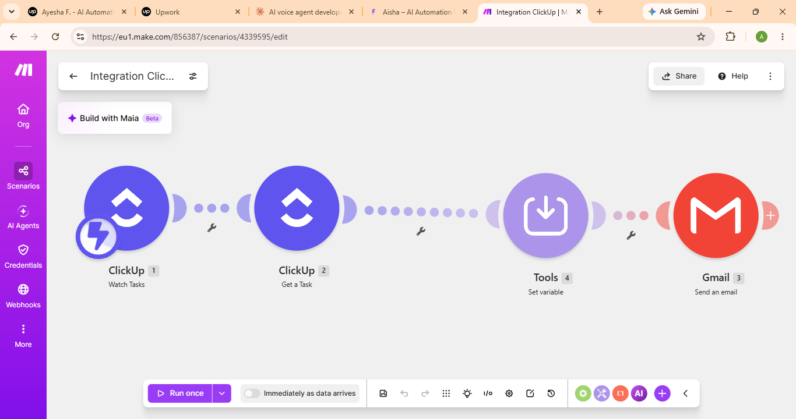

# clickup-task-email-notifier
Make.com automation that watches ClickUp tasks and sends an email notification with task details

## How it works

1. **ClickUp (Watch Tasks)**: Triggers the scenario when a task is updated or created in ClickUp.
2. **ClickUp (Get a Task)**: Retrieves the full details of the triggered task.
3. **Tools (Set variable)**: Formats or stores task data for use in the next step.
4. **Gmail**: Sends an email notification containing the task details.

## Project structure

- `README.md`: project overview (this file)
- `clickup-task-email-notifier-workflow.png`: Make.com scenario screenshot

## Tools used

- [Make.com](https://www.make.com): automation/orchestration
- ClickUp: task management and trigger source
- Gmail: email notifications

